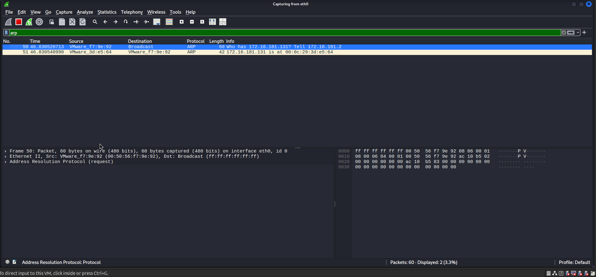
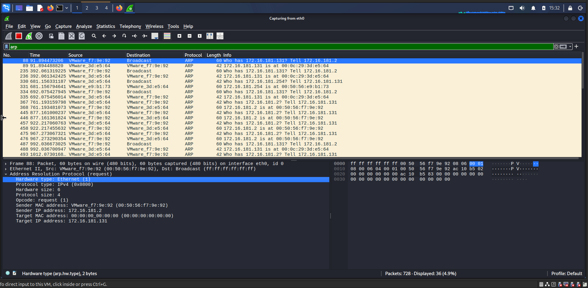

# Hafta 3 – ARP / Wireshark

## Yapılan Çalışma

Wireshark kullanılarak ARP paketleri incelendi.

## Kullanılan Araç

- Kali Linux
- Wireshark

## Ekran Görüntüleri

### 1. Wireshark ARP Capture

ARP paketlerinin Wireshark üzerinden yakalanması.

### 2. ARP Paket Detayları

Yakalanan ARP paketlerinin detayları incelendi.

